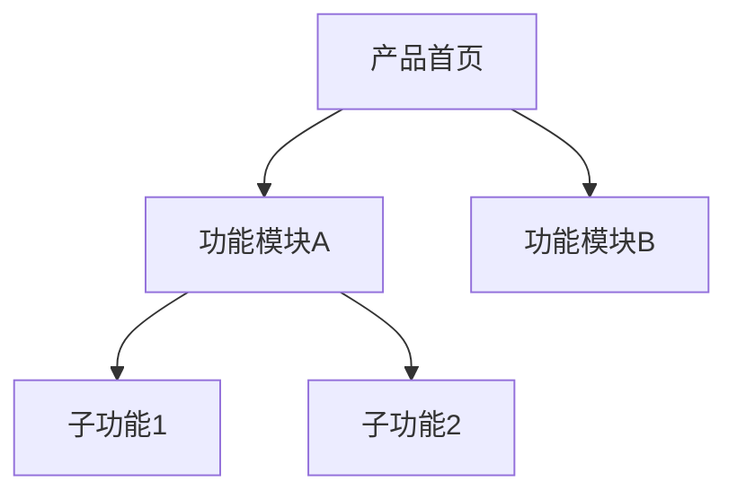
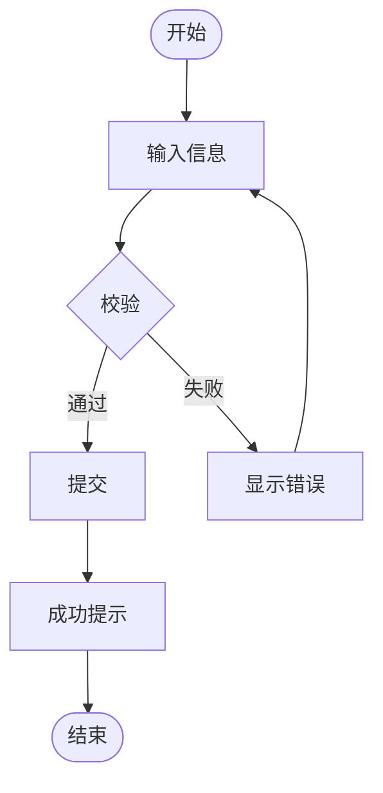

# 产品需求文档模板

## 文档结构模板

```markdown
# [产品/功能名称] - 需求文档 v1.0

## 文档信息

| 属性 | 内容 |
|------|------|
| 文档版本 | v1.0 |
| 创建日期 | YYYY-MM-DD |
| 文档状态 | 草稿/评审中/已确认 |
| 产品模块 | [所属产品模块] |

---

## 一、需求背景

### 1.1 背景说明
[2-3句话描述业务现状和痛点]

### 1.2 目标用户
- **[用户角色1]**：[一句话职责]
- **[用户角色2]**：[一句话职责]

### 1.3 核心价值
1. **[价值点1]**：[一句话说明]
2. **[价值点2]**：[一句话说明]

---

## 二、功能优先级

| 功能模块 | 优先级 | 说明 |
|---------|--------|-----|
| [模块1] | P0 | [一句话] |
| [模块2] | P1 | [一句话] |

> P0=必须实现，P1=重要功能，P2=后续迭代

---

## 三、功能详细设计

### 3.1 [功能模块名]【P0】

#### 功能概述
[一句话说明功能的目的]

- 菜单路径：`[一级菜单] > [二级菜单]`
- 页面URL：`/module/page`

#### 页面原型

**[场景名称]**


> 页面提供搜索和筛选功能，用户可通过关键词搜索或组合筛选条件查找数据。列表支持排序和分页，点击行可查看详情。顶部"新建"按钮用于创建新记录。

---

**[另一个场景/状态]**


> 新建弹窗包含名称（必填，2-64字符）、类型（必填，下拉选择）、描述（选填）三个字段。点击"确定"提交，"取消"关闭弹窗。

---

#### 字段说明

| 字段名称 | 类型 | 必填 | 校验规则 | 备注 |
|---------|------|-----|---------|------|
| 名称 | 文本输入 | 是 | 2-64字符 | 不可重复 |
| 类型 | 下拉选择 | 是 | - | 选项：A/B/C |
| 描述 | 多行文本 | 否 | ≤500字符 | - |

#### 交互说明

| 操作 | 触发 | 成功反馈 | 失败反馈 |
|-----|------|---------|---------|
| 搜索 | 输入后回车或点击按钮 | 列表刷新显示结果 | Toast提示错误原因 |
| 新建 | 点击"新建"按钮 | 弹出表单弹窗 | - |
| 提交表单 | 点击"确定" | Toast"创建成功"，关闭弹窗刷新列表 | 显示具体错误，保留表单内容 |
| 删除 | 点击"删除" | 二次确认后删除，Toast"删除成功" | Toast提示错误原因 |

> **补充说明**（仅在有特殊交互时填写）：
> - [特殊交互1]：[说明]
> - [特殊交互2]：[说明]

#### 状态设计

| 状态 | 触发条件 | 表现 |
|-----|---------|------|
| 空状态 | 列表无数据 | 居中图标 + "暂无数据" + 新建按钮 |
| 加载中 | 请求数据时 | 骨架屏或Loading |
| 加载失败 | 接口报错 | 错误提示 + 重试按钮 |

---

### 3.2 [下一个功能模块]【P1】

（按上述结构继续）

---

## 四、版本规划

| 版本 | 功能范围 | 说明 |
|-----|---------|------|
| v1.0 | [功能1]、[功能2] | MVP版本 |
| v1.1 | [功能3] | 第二阶段 |

---

## 五、修订记录

| 版本 | 日期 | 修订人 | 修订内容 |
|-----|------|-------|---------|
| v1.0 | YYYY-MM-DD | - | 初始版本 |
```

---

## 附录：Mermaid 图表示例

按需使用，不是必须包含。

### A.1 功能结构图



### A.2 操作流程图


