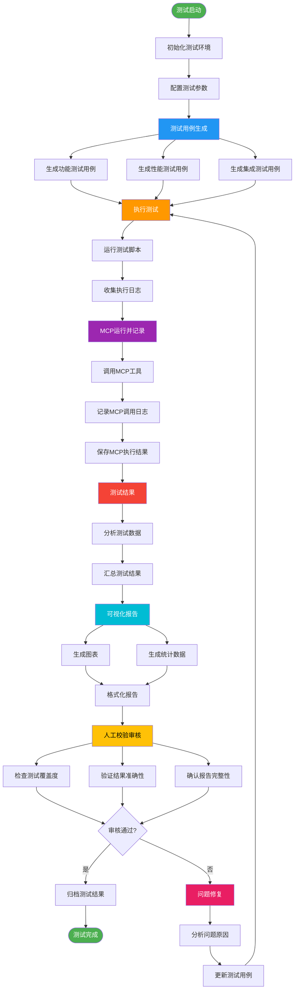
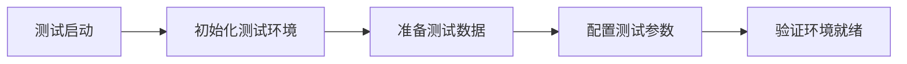
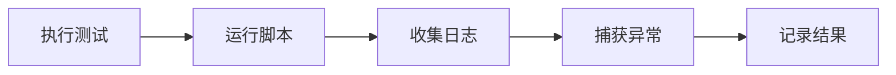
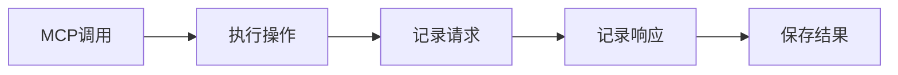
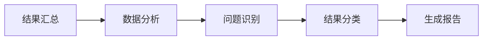
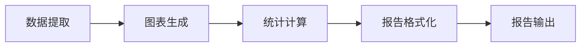
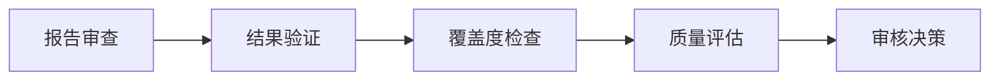
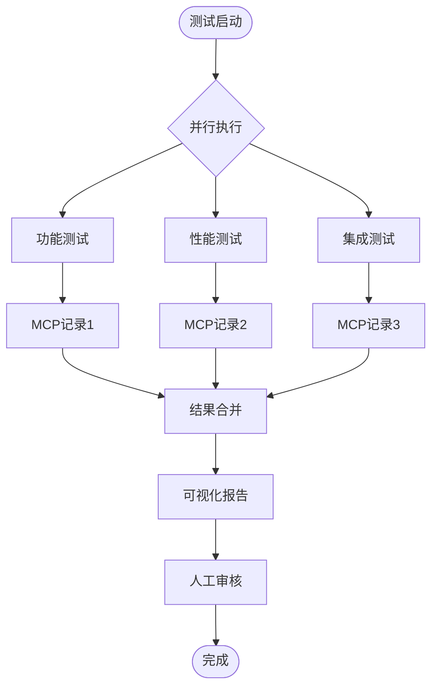
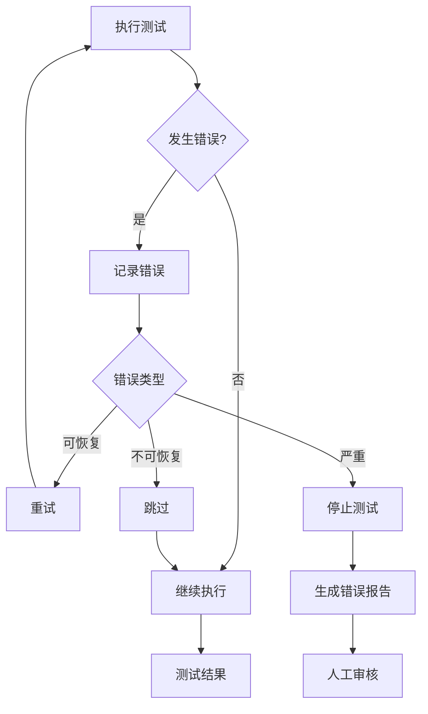
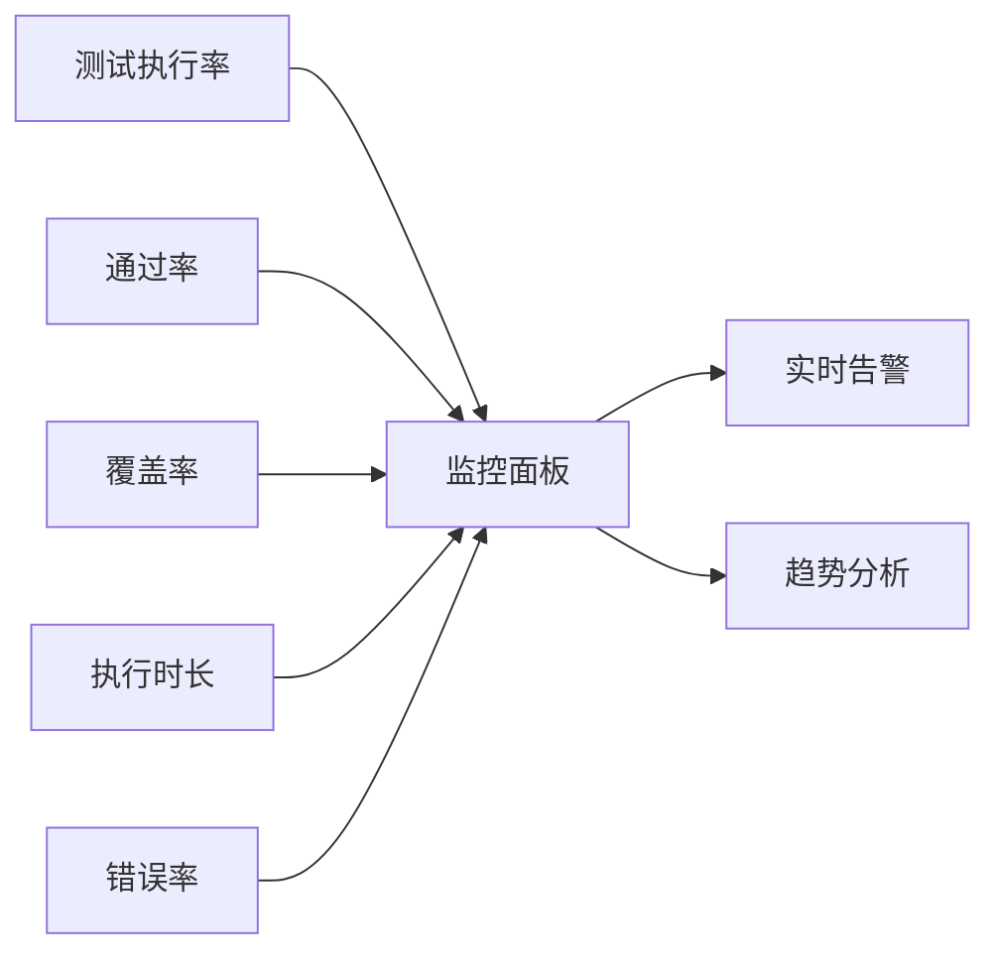

# 测试流程详细流程图

## 完整测试流程（详细版）

## 各阶段详细说明

### 阶段1: 测试启动

**关键活动：**
- 环境初始化
- 数据准备
- 参数配置
- 环境验证

### 阶段2: 测试用例生成

**关键活动：**
- 需求分析
- 场景设计
- 用例编写
- 用例评审

### 阶段3: 执行测试

**关键活动：**
- 脚本执行
- 日志收集
- 异常处理
- 结果记录

### 阶段4: MCP运行并记录

**关键活动：**
- MCP工具调用
- 请求/响应记录
- 结果持久化
- 错误处理

### 阶段5: 测试结果

**关键活动：**
- 数据汇总
- 结果分析
- 问题识别
- 报告生成

### 阶段6: 可视化报告

**关键活动：**
- 图表生成
- 统计分析
- 报告格式化
- 多格式输出

### 阶段7: 人工校验审核

**关键活动：**
- 报告审查
- 结果验证
- 覆盖度检查
- 质量评估

## 并行处理流程

## 异常处理流程

## 关键指标监控

## 流程优化建议

1. **自动化程度提升**
   - 测试用例自动生成
   - 结果自动分析
   - 报告自动生成

2. **并行执行优化**
   - 多任务并行执行
   - 资源池管理
   - 负载均衡

3. **反馈机制**
   - 实时状态更新
   - 异常及时通知
   - 结果快速反馈

4. **质量保障**
   - 多维度验证
   - 交叉检查
   - 持续改进

