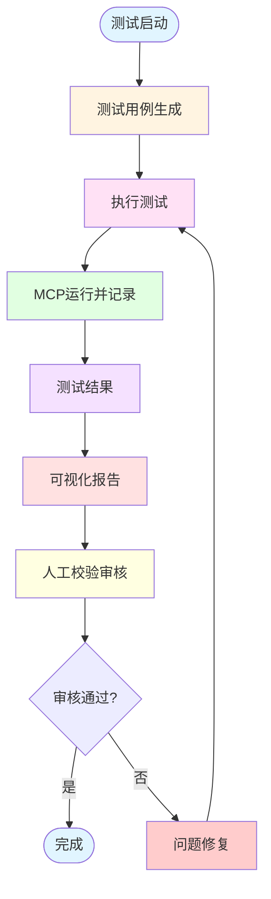

# 测试流程流程图

## 完整测试流程

## 详细流程说明

### 1. 测试启动
- 触发测试任务
- 初始化测试环境
- 准备测试数据

### 2. 测试用例生成
- 根据需求生成测试用例
- 定义测试场景和预期结果
- 配置测试参数

### 3. 执行测试
- 运行自动化测试脚本
- 执行功能测试
- 收集执行日志

### 4. MCP运行并记录
- 调用MCP工具执行操作
- 记录MCP调用日志
- 保存执行结果

### 5. 测试结果
- 汇总测试数据
- 分析测试结果
- 生成原始测试报告

### 6. 可视化报告
- 生成图表和统计信息
- 格式化测试报告
- 展示关键指标

### 7. 人工校验审核
- 人工审查测试结果
- 验证报告准确性
- 确认测试覆盖度

## 流程分支说明

- **审核通过**：测试流程完成，结果归档
- **审核不通过**：进入问题修复流程，修复后重新执行测试

