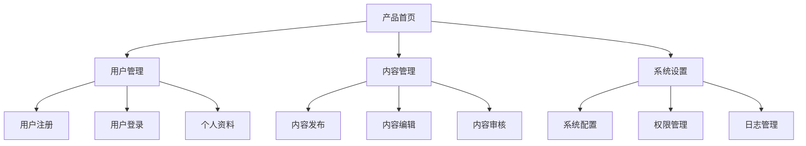
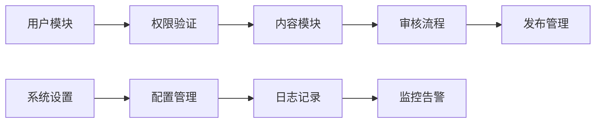
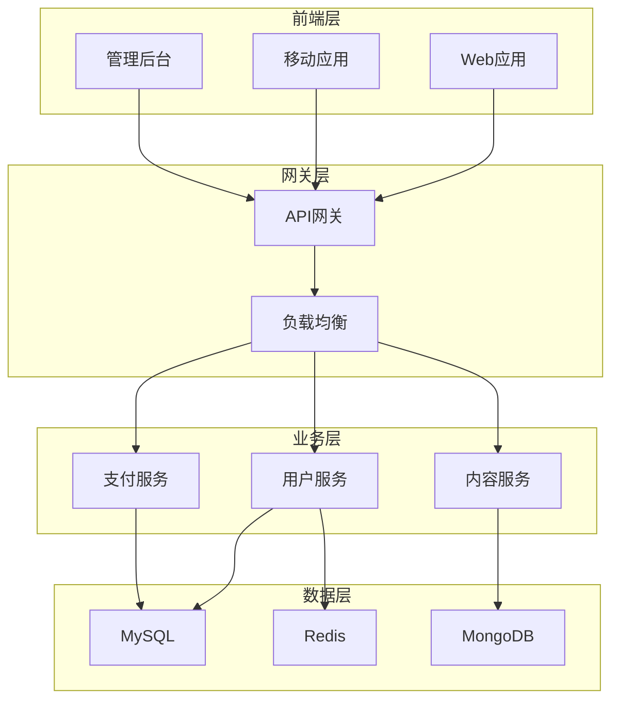
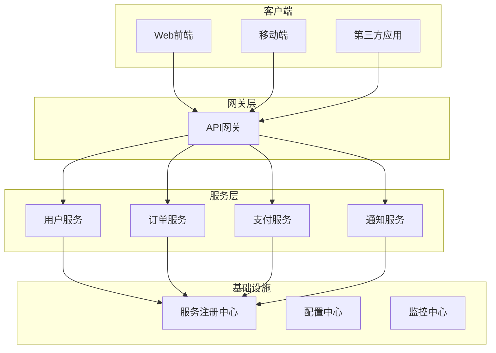
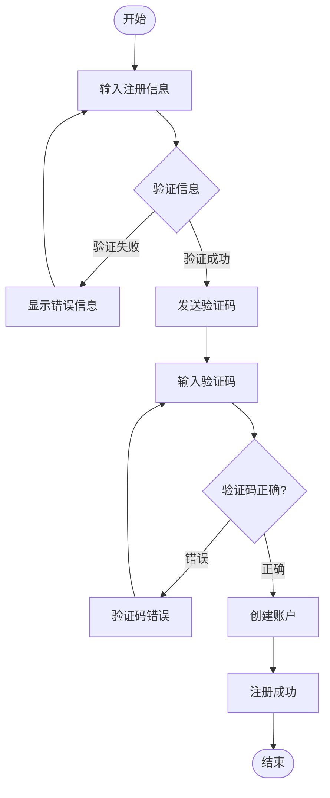
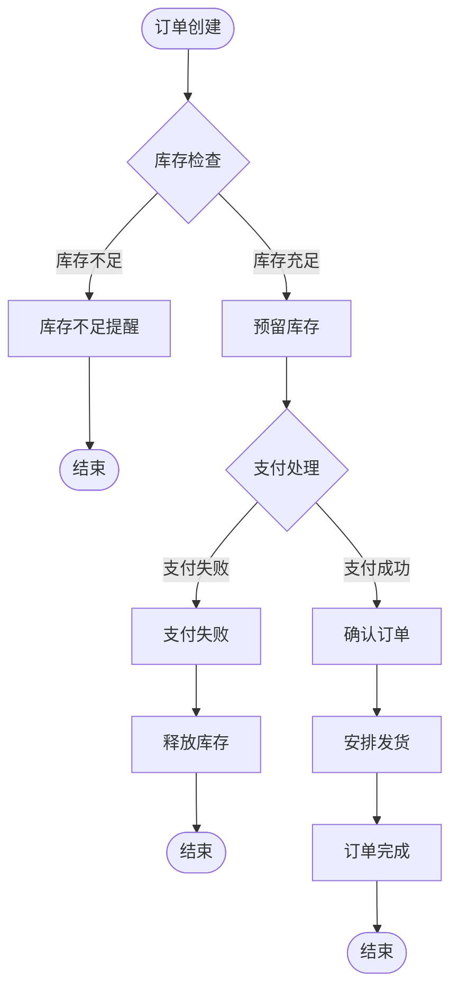
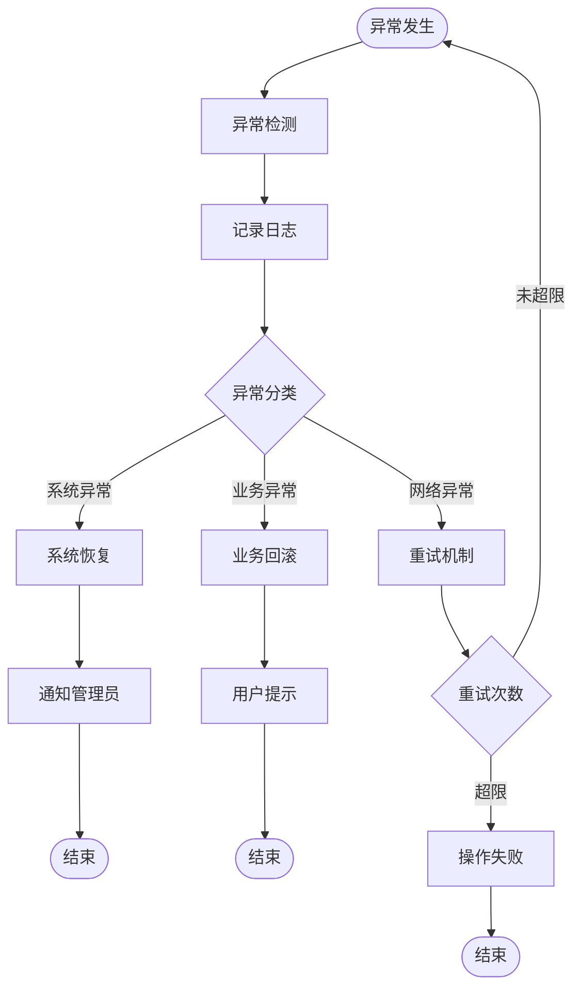
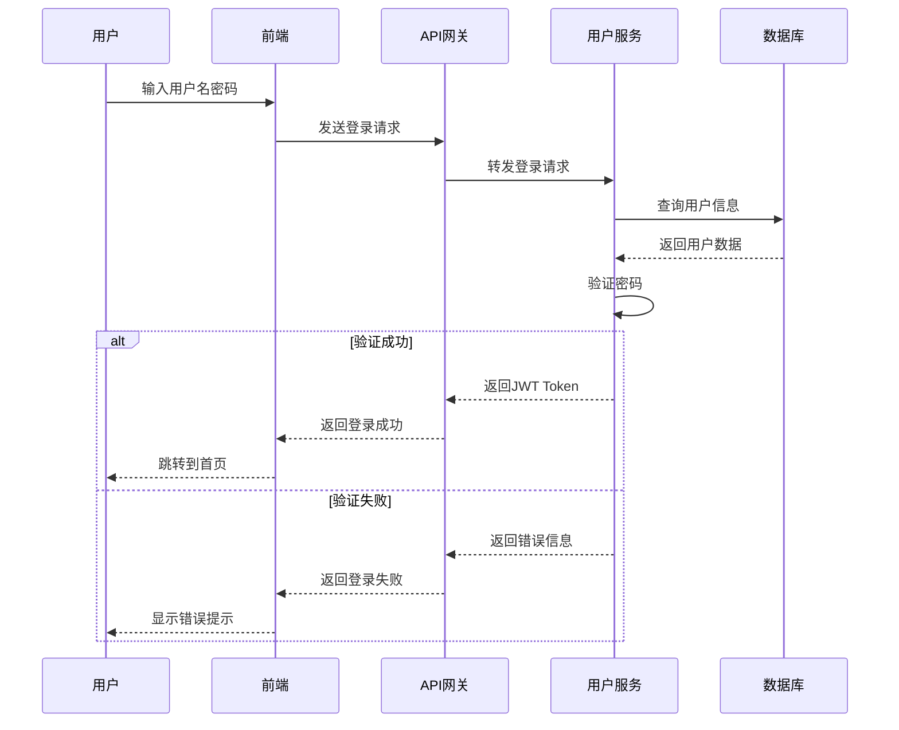
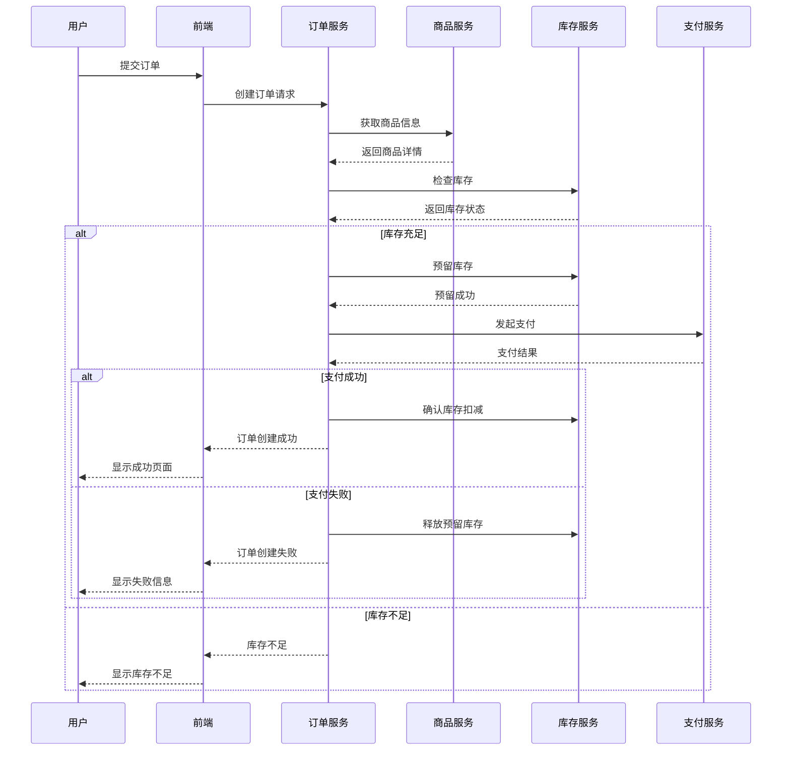
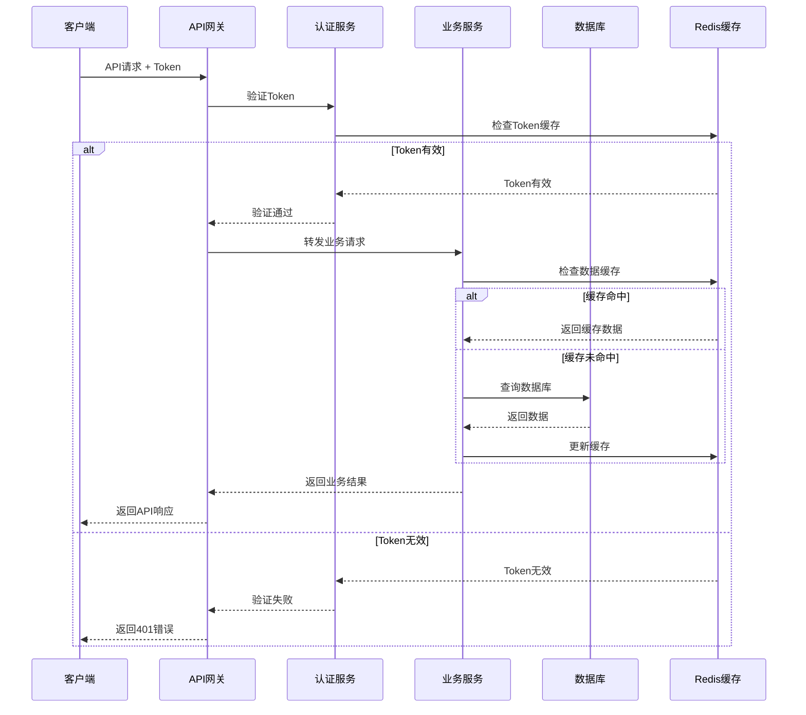

# 产品文档模板

## 【产品交互文档模板】

### 基础结构
```markdown
# [产品名称] 产品交互文档

## 1. 导航设计
### 1.1 主导航
#### 主导航设计
**定义**: 产品的核心导航结构，通常位于页面顶部或侧边，承载主要功能模块的入口，一般为顶部横向。
**设计要求**:
- **位置布局** - 导航条位置
- **菜单结构** - 一级菜单项的组织和分类
- **视觉样式** - 导航条背景色、字体、图标、间距
- **交互状态** - 默认、悬停、激活、禁用状态的视觉反馈
### 1.2 次导航
#### 次导航设计
**定义**: 主导航下的二级或多级导航，提供更细分的功能入口和页面导航，一般为左侧纵向。
**设计要求**:
[重复上述结构]

## 2. 页面结构
### 2.1 功能区域1
### 2.2 功能区域2
### 2.2 功能区域3

## 3. 交互流程设计
### 3.1 用户流程1
### 3.2 用户流程2
### 3.3 用户流程3
```

## 【产品功能文档模板】

### 基础结构
```markdown
# [产品名称] 产品功能文档

## 1. 核心功能详述

### 1.1 [功能模块1]
#### 1.1.1 功能描述
#### 1.1.2 使用场景
#### 1.1.3 操作流程
#### 1.1.4 业务规则
#### 1.1.5 异常处理

### 1.2 [功能模块2]
[重复上述结构]
```

## 【功能结构图模板】

### Mermaid语法示例


### 模块关系图示例


## 【系统架构图模板】

### 整体架构示例


### 微服务架构示例


## 【使用流程图模板】

### 用户注册流程示例


### 订单处理流程示例


### 异常处理流程示例


## 【UML序列图模板】

### 用户登录序列图示例


### 订单创建序列图示例


### API调用序列图示例


## 【模板使用说明】

### 选择合适的模板
- **产品交互文档** - 适用于UI/UX设计、前端开发
- **产品功能文档** - 适用于产品规划、需求分析
- **功能结构图** - 适用于架构设计、功能梳理
- **系统架构图** - 适用于技术方案、系统设计
- **使用流程图** - 适用于业务流程、用户指导
- **UML序列图** - 适用于系统交互、API设计

### 自定义修改
1. **替换占位符** - 将模板中的 `[产品名称]`、`[功能模块]` 等替换为实际内容
2. **调整章节结构** - 根据实际需求增删章节
3. **修改图表内容** - 根据具体业务场景修改Mermaid图表
4. **扩展模板内容** - 在基础模板上增加特定的业务内容