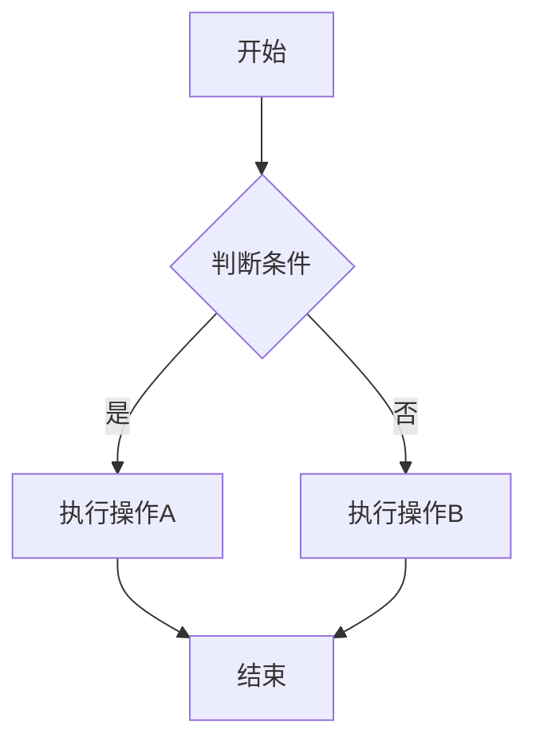
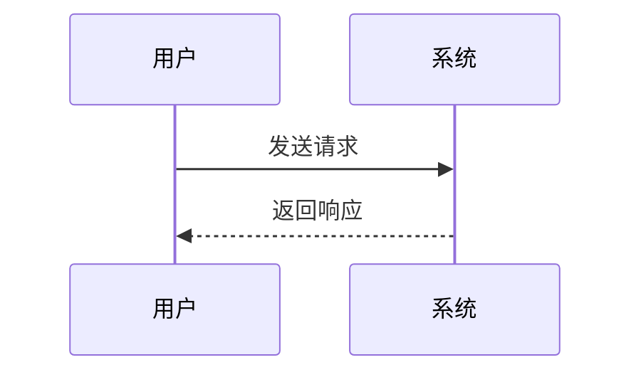
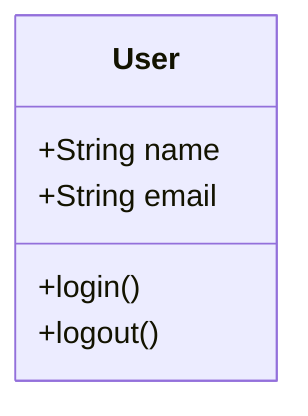

# 文档编写规范

## 1. 标题规范

### 1.1 标题层级
- **H1 (#)** - 文档标题，每个文档只有一个
- **H2 (##)** - 主要章节标题
- **H3 (###)** - 子章节标题
- **H4 (####)** - 详细内容标题
- **H5 (#####)** - 更细分的内容标题
- **H6 (######)** - 最小层级标题

### 1.2 标题命名规范
```markdown
# 正确示例
## 1. 产品概述
### 1.1 产品定位
#### 1.1.1 目标用户群体

# 错误示例
## 产品概述（缺少编号）
### 产品定位（层级不对应）
```

### 1.3 标题编写要求
- ✅ 使用阿拉伯数字编号
- ✅ 标题简洁明确，不超过20个字符
- ✅ 避免使用特殊符号和标点
- ✅ 保持同级标题格式一致
- ❌ 不使用全大写字母
- ❌ 不在标题末尾加句号

## 2. 内容规范

### 2.1 段落结构
```markdown
# 正确的段落结构
每个段落应该表达一个完整的观点或概念。段落之间使用空行分隔，保持内容的清晰性和可读性。

段落内容应该逻辑清晰，语言简洁。避免过长的句子和复杂的表述。

# 错误的段落结构
内容全部堆积在一起没有分段落这样会导致阅读困难而且逻辑不清晰用户很难快速理解文档内容。
```

### 2.2 强调和标注
- **粗体** - 用于重要概念、关键词
- *斜体* - 用于术语、引用内容
- `代码` - 用于代码片段、文件名、命令
- ==高亮== - 用于特别重要的内容（如支持）
- ~~删除线~~ - 用于已废弃的内容

### 2.3 列表使用规范

#### 无序列表
```markdown
- 第一项内容
- 第二项内容
  - 子项目1
  - 子项目2
- 第三项内容
```

#### 有序列表
```markdown
1. 第一步操作
2. 第二步操作
   1. 详细步骤A
   2. 详细步骤B
3. 第三步操作
```

#### 任务列表
```markdown
- [x] 已完成的任务
- [ ] 待完成的任务
- [ ] 另一个待完成的任务
```

### 2.4 Emoji使用规范
适当使用emoji可以提高文档的可读性和友好度：

- 🎯 **目标/重点** - 表示重要目标或核心内容
- ✅ **正确/完成** - 表示正确做法或已完成项目
- ❌ **错误/禁止** - 表示错误做法或禁止操作
- 📋 **列表/清单** - 表示清单或列表内容
- 🔧 **工具/配置** - 表示工具使用或配置相关
- 📊 **数据/图表** - 表示数据分析或图表内容
- 🚀 **开始/启动** - 表示开始操作或快速入门
- 💡 **提示/建议** - 表示提示信息或建议
- ⚠️ **警告/注意** - 表示需要注意的重要信息

## 3. 图表规范

### 3.1 Mermaid图表语法

#### 流程图 (Flowchart)


#### 序列图 (Sequence Diagram)


#### 类图 (Class Diagram)


### 3.2 图表命名规范
- 图表标题使用中文，简洁明确
- 节点名称统一使用中文或英文，不混用
- 连接线标签使用动词或动作描述
- 颜色使用保持一致性

### 3.3 图表布局要求
- 从上到下、从左到右的逻辑顺序
- 避免交叉连线，保持清晰
- 节点大小适中，文字清晰可读
- 适当使用子图(subgraph)分组

## 4. 代码规范

### 4.1 代码块格式
````markdown
```语言类型
代码内容
```
````

### 4.2 支持的语言类型
- `markdown` - Markdown语法
- `javascript` - JavaScript代码
- `python` - Python代码
- `json` - JSON数据
- `yaml` - YAML配置
- `bash` - Shell命令
- `sql` - SQL语句
- `mermaid` - Mermaid图表

### 4.3 代码注释规范
```python
# 正确的代码示例
def calculate_total(items):
    """
    计算商品总价
    
    Args:
        items (list): 商品列表
        
    Returns:
        float: 总价格
    """
    total = 0
    for item in items:
        total += item.price  # 累加商品价格
    return total
```

### 4.4 内联代码使用
- 文件名：`config.json`
- 命令：`npm install`
- 变量名：`user_id`
- API端点：`/api/users`

## 5. 链接规范

### 5.1 内部链接
```markdown
# 相对路径链接
[产品文档模板](./产品文档模板.md)
[使用指南](../使用指南.md)

# 锚点链接
[跳转到标题规范](#1-标题规范)
```

### 5.2 外部链接
```markdown
# 外部链接
[Mermaid官方文档](https://mermaid-js.github.io/mermaid/)

# 带标题的链接
[Mermaid官方文档 - 流程图语法](https://mermaid-js.github.io/mermaid/#/flowchart)
```

### 5.3 图片链接
```markdown
# 本地图片


# 网络图片


# 带标题的图片

```

## 6. 表格规范

### 6.1 基础表格格式
```markdown
| 列标题1 | 列标题2 | 列标题3 |
|---------|---------|---------|
| 内容1   | 内容2   | 内容3   |
| 内容4   | 内容5   | 内容6   |
```

### 6.2 对齐方式
```markdown
| 左对齐 | 居中对齐 | 右对齐 |
|:-------|:--------:|-------:|
| 内容   |   内容   |   内容 |
```

### 6.3 复杂表格示例
```markdown
| 功能模块 | 优先级 | 开发状态 | 负责人 | 预计完成时间 |
|----------|:------:|:--------:|--------|:------------:|
| 用户管理 | 高     | ✅ 已完成 | 张三   | 2025-01-15   |
| 订单系统 | 高     | 🔄 进行中 | 李四   | 2025-02-01   |
| 支付模块 | 中     | 📋 待开始 | 王五   | 2025-02-15   |
```
